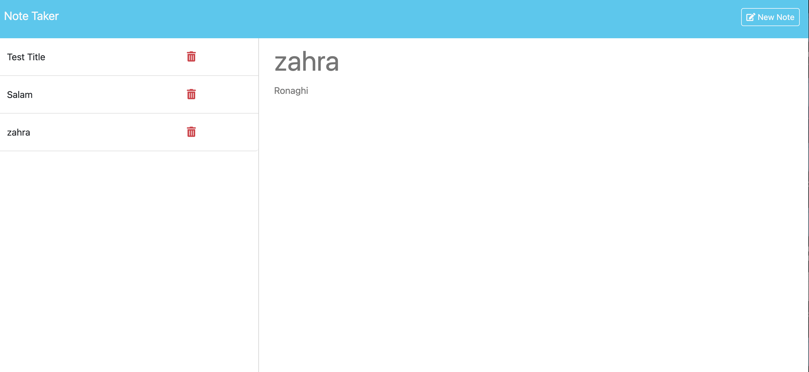

# note-taker
Note Taker

## Introduction
This is a simple Node.js module designed to handle file-based storage operations for a note-taking application. It provides methods for reading, writing, adding, and removing notes from a JSON file.

## Installation
To use this app in your local machin, follow these steps:

1- Use git clone to copy from my github to your local machine
2- Install the modules using npm
3- run the app

## Usage

## Deploy

The link is: https://note-taker-pcm8.onrender.com/

## Dependencies
This module relies on the following dependencies:

1- util
2- fs
3- uuid
4- express

## Contributing
Contributions are welcome! Feel free to submit bug reports, feature requests, or pull requests through the GitHub repository.

## License
This project is licensed under the MIT License.

## Credits
This module was developed by Mohammad.

